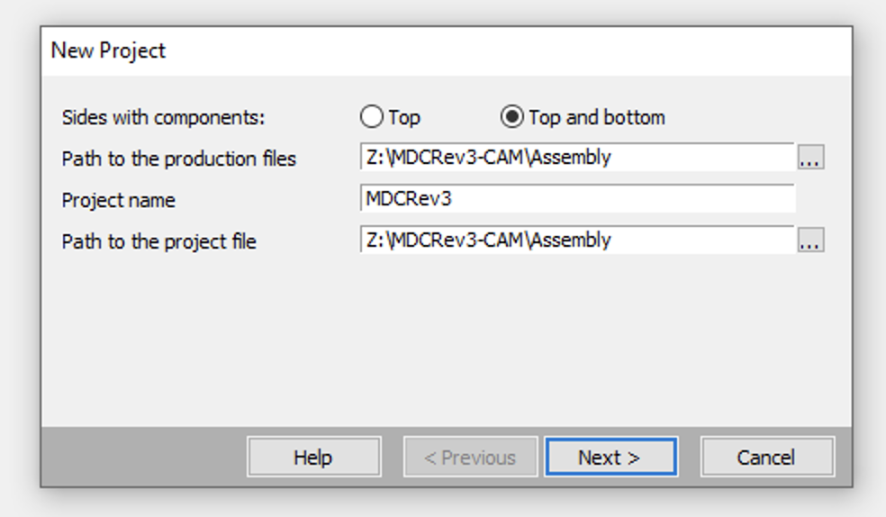
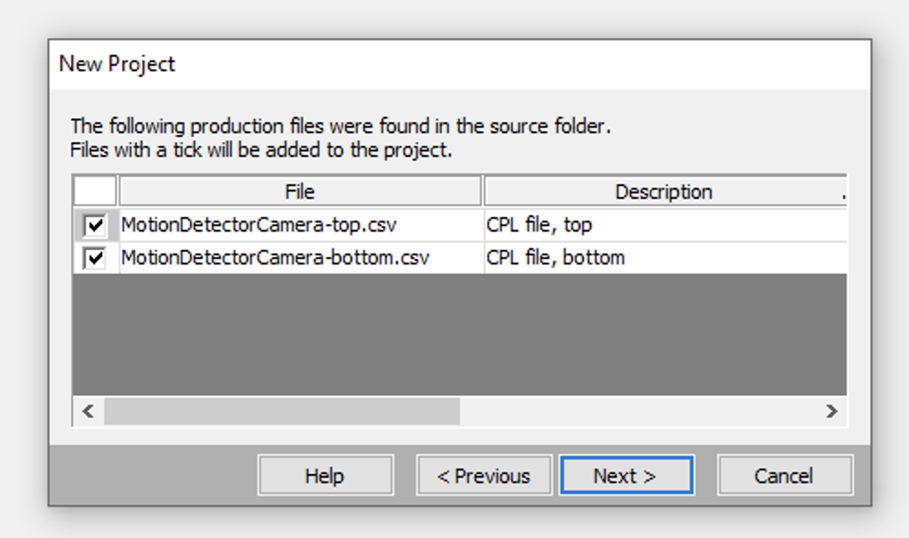
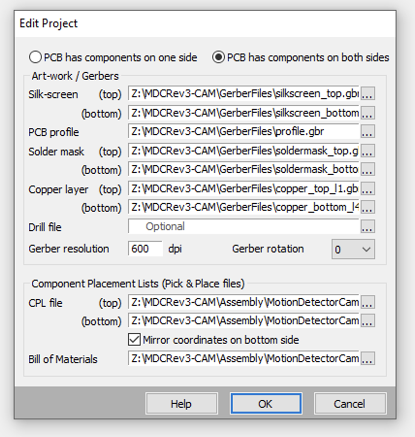

## Create a VisualPlace project

* Export CAM data using Eagle
    * In board layout, open CAM Processor (the factory icon)
    * Assembly > Bill of Material
        * Output Type > CSV
    * Assembly > Pick and Place
        * Output Type > CSV
    * Export to Project Directory > Disable
    * Click "Process Job"
        * Output to WindowsSharedFolder
    * Rename resulting "CAMOutputs" directory to "ProjectRevX-CAM"

* Export VisualPlace "CPL" data
    * In Eagle board layout, at command prompt: `run VisualPlace-ExportCPL.ulp`
    * Move the resulting two CSV files (PCB/Project-bottom.csv, PCB/Project-top.csv) to the ProjectRevX-CAM/Assembly directory

* In VisualPlace, create a new project
    * Fill in appropriate fields as shown:
        
        
        
    * Click through components on both sides of the board to verify that VisualPlace determined the positions correctly
