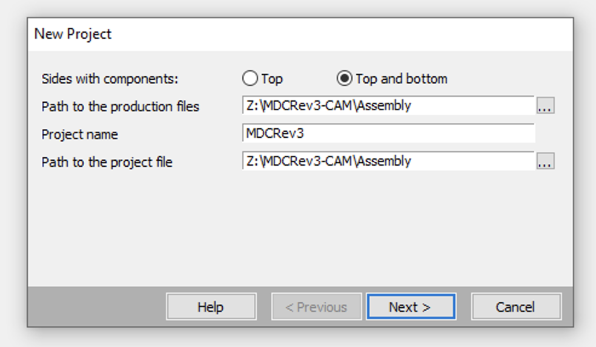
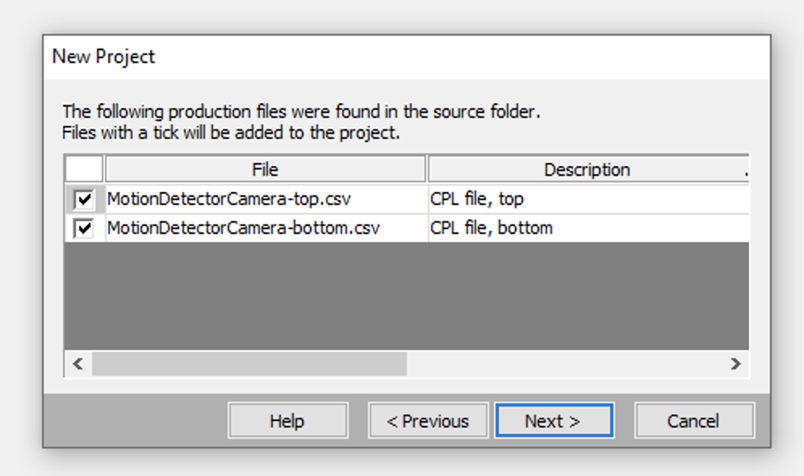
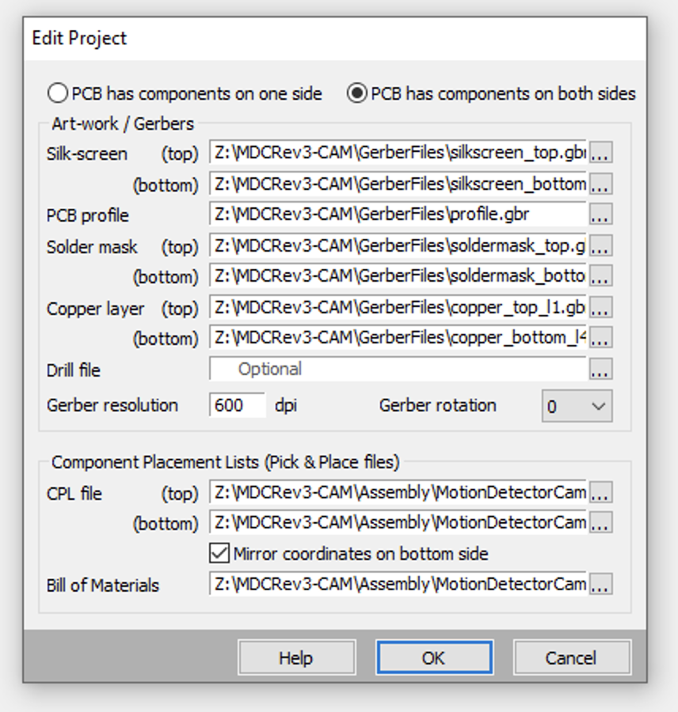

## Create a VisualPlace project

* Export CAM data using Eagle
    * In board layout, open CAM Processor (the factory icon)
    * Assembly > Bill of Material
        * Output Type > CSV
    * Assembly > Pick and Place
        * Output Type > CSV
    * Export to Project Directory > No
    * Process Job
        * Output to WindowsSharedFolder
    * Rename resulting "CAMOutputs" directory to "ProjectRevX-CAM"

* Export VisualPlace "CPL" data
    * In Eagle board layout, at command prompt: `run VisualPlace-ExportCPL.ulp`
    * Move the resulting two CSV files:
            pcb/Project-bottom.csv
            pcb/Project-top.csv
        
        to the ProjectRevX-CAM/Assembly directory

* Create a new VisualPlace project and fill in the appropriate fields:
    
    
    
